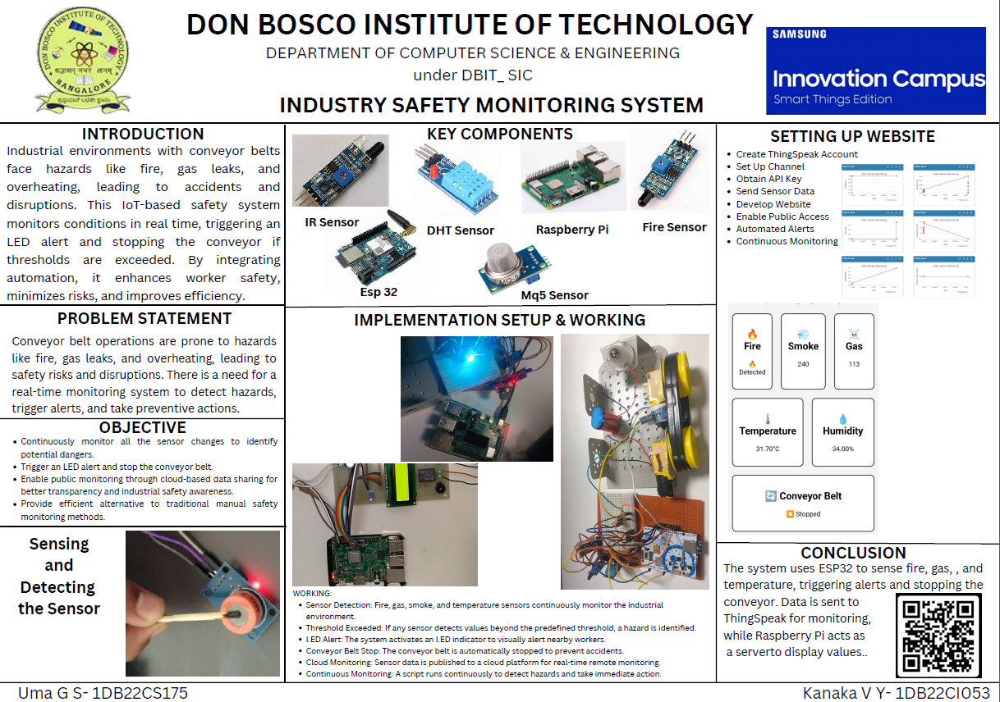

# 🚧 Industry Safety and Monitoring System (IoT)

## 📌 Project Description
This project is an IoT-based Industry Safety and Monitoring System designed to monitor industrial environments and ensure worker safety in real-time.

---

## ⚙️ Features
- 🔹 Real-time monitoring
- 🔹 Gas, fire, and temperature detection
- 🔹 Automatic alert system
- 🔹 Conveyor belt control (stop during danger)
- 🔹 Cloud monitoring using ThingSpeak

---

## 🖼️ Project Poster

---

## 🛠️ Technologies Used
- Python / Embedded C
- Raspberry Pi
- ESP32
- IoT Sensors (DHT, MQ5, Fire, IR)
- ThingSpeak Cloud
- HTML Dashboard

---

## 📁 Project Structure
- `index.html` → Web dashboard UI
- `main.py` → Backend / IoT logic (Raspberry Pi)
- `poster.jpg` → Project poster
- `README.md` → Documentation

---

## 🚀 How It Works
1. Sensors collect real-time environmental data  
2. ESP32/Raspberry Pi processes data  
3. If threshold exceeds → alert triggered  
4. Conveyor belt stops automatically  
5. Data sent to ThingSpeak for monitoring  

---

## 🌐 Live Demo (if deployed)
[Click Here](https://your-username.github.io/repo-name/)

---

## 🎥 Project Demo
(Add your video link here)

---

## 📌 Future Improvements
- AI-based hazard prediction  
- Mobile app integration  
- Advanced analytics dashboard  

---

## 👨‍💻 Author
**Kanaka VY**
